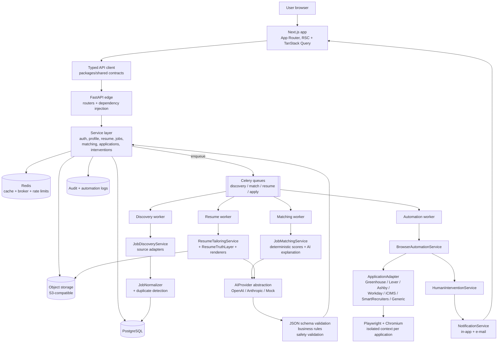

# 1. System Architecture

## 1.1 Guiding principles

1. **Human-in-the-loop by default.** Ordinary, factual application steps are automated.
   CAPTCHA, MFA/OTP, legal attestations, ambiguous questions and unsupported flows
   *stop* the run and hand control back to the user. The platform never attempts to
   defeat a verification control, an anti-bot system, an access control or an
   authentication mechanism.
2. **Nothing is invented.** Every claim that reaches an employer is traceable to a
   record the user supplied or approved (see `ResumeTruthLayer`, §6 of the docs).
3. **AI never drives the browser.** Model output is JSON, schema-validated, business-rule
   checked and safety-checked *before* any deterministic executor touches a page.
4. **Modules are replaceable.** Provider-shaped concerns (LLM, storage, e-mail, billing,
   job sources, ATS flows) sit behind interfaces with at least one local mock.

## 1.2 High-level diagram

## 1.3 Request paths

**Synchronous (user-facing).** Browser → Next.js route handler or direct fetch →
FastAPI router → Pydantic request model → service → repository/SQLAlchemy → response
model. Routers contain no business logic; services contain no HTTP concepts.

**Asynchronous (automation).** Service writes a row (`application_tasks`) and enqueues a
Celery task carrying only identifiers. The worker re-reads state from PostgreSQL, so a
task is safe to retry and never carries secrets in the broker payload.

**Verification pause.** Worker detects a stop condition → persists an `intervention`
row + screenshot → transitions the application to `WAITING_FOR_VERIFICATION` →
emits a notification → the browser context is retained (parked) until the user
continues or the TTL expires, at which point it is destroyed and the run is marked
failed with `CAPTCHA`/`OTP`/`MFA` as the reason.

## 1.4 Boundaries

| Boundary | Contract | Local mock |
| --- | --- | --- |
| LLM | `AIProvider.complete_json(prompt, schema)` | `MockAIProvider` (deterministic fixtures) |
| Object storage | `ObjectStorage.put/get/presign/delete` | `LocalFilesystemStorage` |
| E-mail | `EmailSender.send(message)` | `ConsoleEmailSender` (writes to log + outbox table) |
| Job source | `JobSource.fetch(query) -> list[RawJob]` | `SampleFeedSource` (local JSON fixture, clearly labelled sample data) |
| ATS flow | `ApplicationAdapter` | `MockAtsAdapter` against local mock ATS sites |
| Billing | `BillingService` | `NoopBillingService` |

Nothing in the service layer imports `openai`, `anthropic`, `boto3`, `stripe` or
`playwright` directly; those live behind the packages above.
