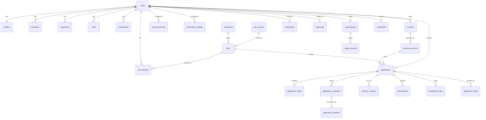

# 3. Database ERD

All tables carry `id UUID PK`, `created_at`, `updated_at`. Tables that hold user content
carry `deleted_at` (soft delete). Every user-owned table carries `user_id` with an index
and `ON DELETE CASCADE`, so account deletion is a single statement plus object-storage
cleanup.

## Table notes

| Table | Key columns | Indexes / constraints |
| --- | --- | --- |
| `users` | email (citext), password_hash, role, is_active, email_verified_at | unique(lower(email)) |
| `profiles` | 1:1 with users; personal, professional, work-authorization blocks | unique(user_id) |
| `education` / `experience` | ordered by `sort_order`, nullable `end_date` = current | idx(user_id) |
| `skills` | name, category, years_experience, `is_verified` | unique(user_id, lower(name)) |
| `certifications` | name, issuer, issued_on, expires_on, credential_id | idx(user_id) |
| `resumes` | `is_master`, original file key, parsed `structured` JSONB, checksum | idx(user_id, is_master) |
| `resume_versions` | FK resume + job, template, storage keys (docx/pdf), `provenance` JSONB, `quality` JSONB | unique(resume_id, job_id, version) |
| `job_sources` | slug, kind (`feed`/`career_page`/`manual`), enabled, config JSONB | unique(slug) |
| `companies` | name, `normalized_name`, domain, careers_url | unique(normalized_name) |
| `jobs` | full normalized job (see §7), `content_hash`, `dedupe_key` | unique(source_id, source_job_id); unique(dedupe_key); idx(company_id, title) |
| `job_matches` | per-component scores, recommendation, matched/missing skills, risks, explanation | unique(user_id, job_id) |
| `applications` | status enum, `dedupe_hash`, submitted_at, confirmation fields, failure_reason | unique(user_id, dedupe_hash); idx(user_id, status) |
| `application_steps` | step name, status, started/finished, payload JSONB | idx(application_id, created_at) |
| `application_questions` | normalized field descriptor, question text, category, `is_sensitive` | idx(application_id) |
| `application_answers` | answer, confidence, source_ids, `requires_review`, approved_by_user_at | unique(question_id) |
| `browser_sessions` | application FK, ats, state enum, encrypted `state_blob`, expires_at | idx(application_id) |
| `interventions` | type enum, status, reason, screenshot key, page url, resolved_at | idx(user_id, status) |
| `notifications` | channel, kind, title, body, read_at, payload | idx(user_id, read_at) |
| `automation_logs` | structured event rows: event, ats, duration_ms, level, data JSONB | idx(application_id, created_at) |
| `audit_logs` | actor_user_id, action, entity, entity_id, ip, user_agent, before/after | idx(actor_user_id, created_at) |
| `application_tasks` | queue task mirror: priority, attempts, timings, failure_reason | idx(status, priority) |
| `subscriptions` / `usage_records` | plan, status, period, metered counters | idx(user_id) |
| `credentials` | vault entries: label, kind, encrypted secret (envelope), last_used_at | idx(user_id) — never selected by list endpoints |

## Sensitive-column policy

`users.password_hash`, `credentials.secret_encrypted`, `browser_sessions.state_blob`
are excluded from every response model and from the ORM's default loading path
(`deferred`). No OTP code is ever persisted; it is passed in memory to the worker and
discarded.
